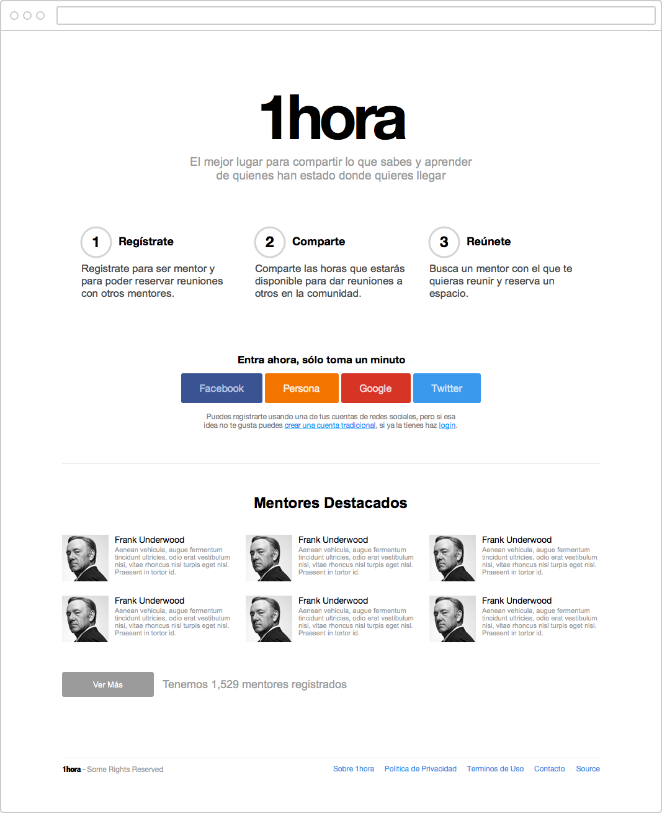
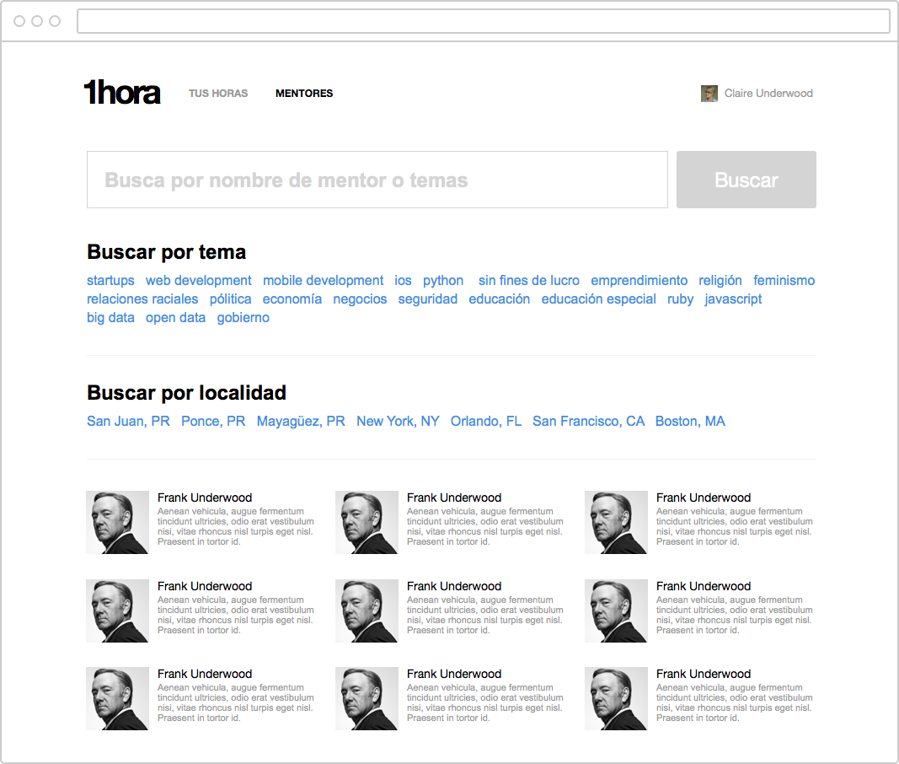
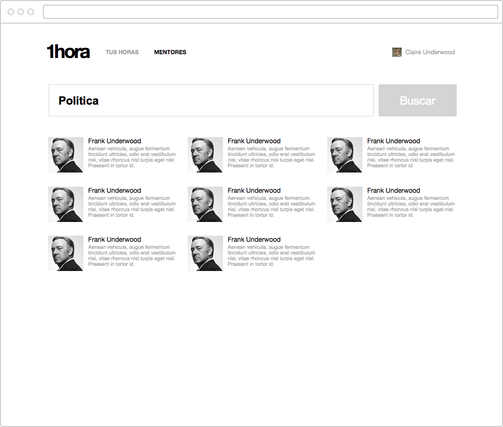
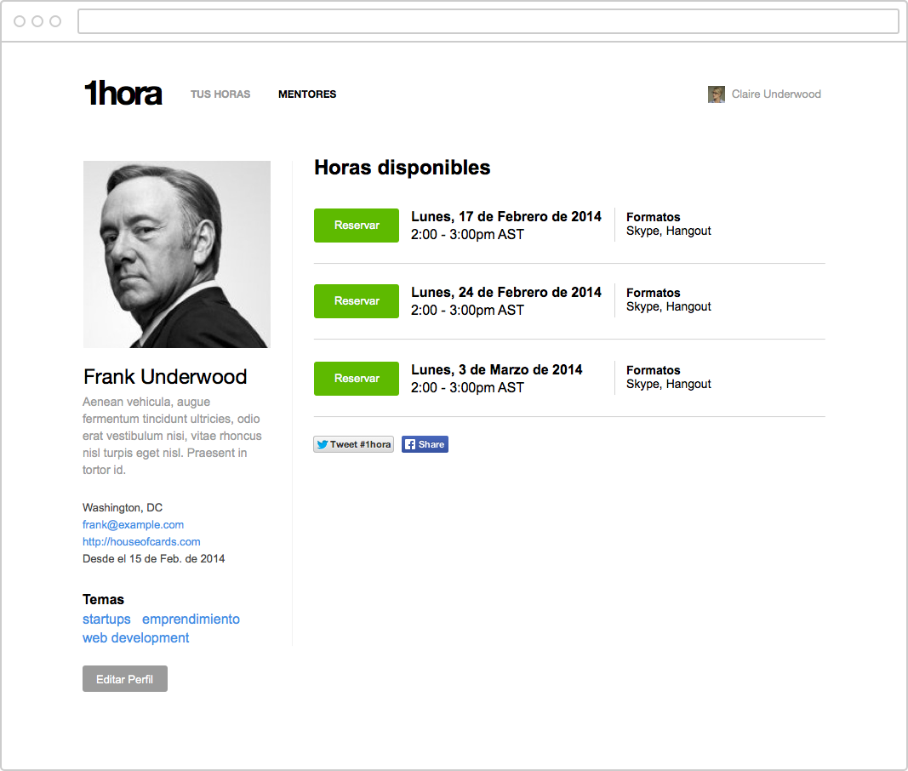
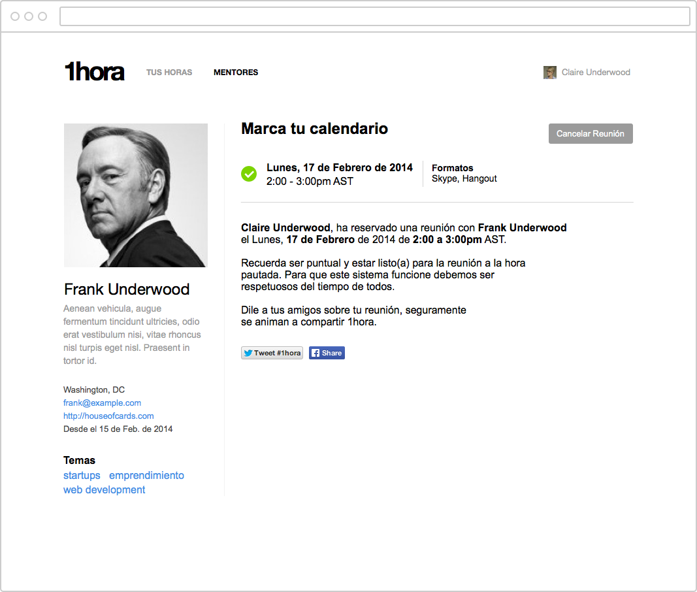
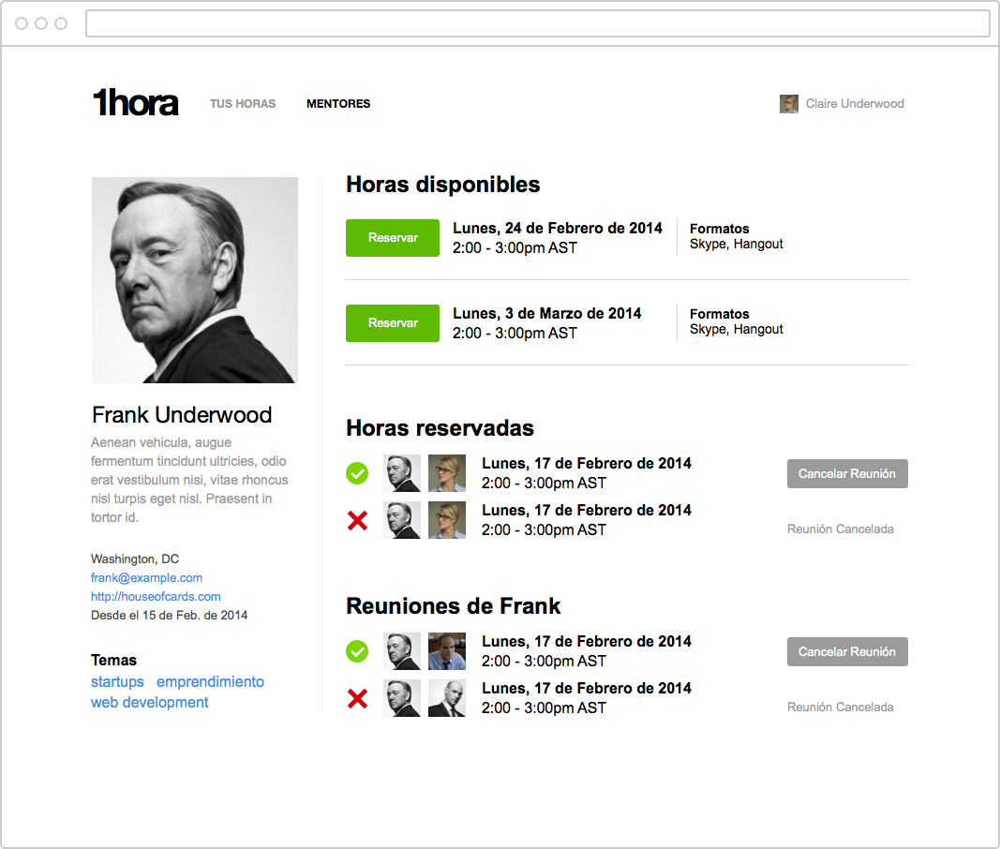
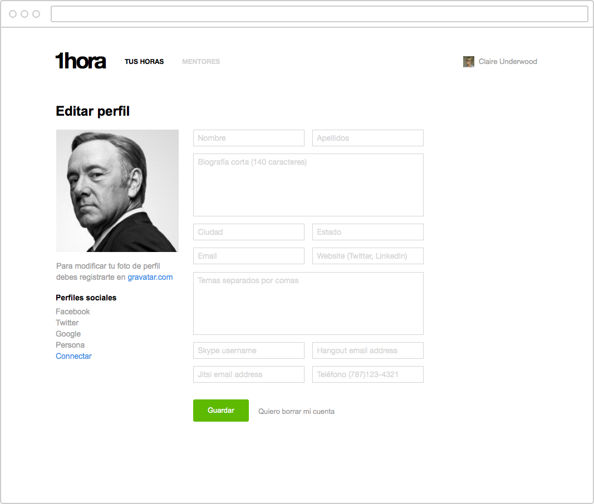
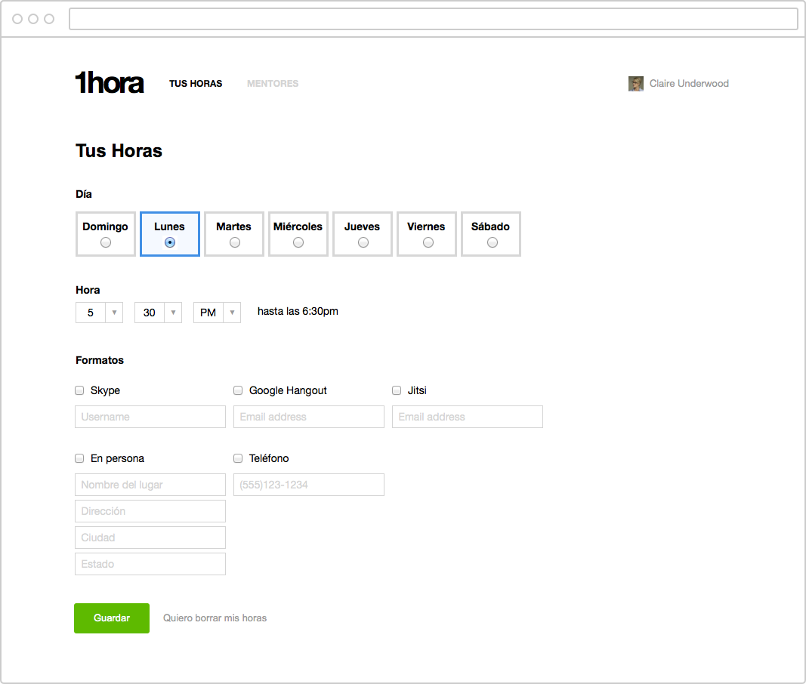

# Horas - Design Branch
Este branch es para compartir y mantener todos los archivos relacionados al diseño de este proyecto. El primer diseño fue hecho usando la aplicación [Sketch](http://www.bohemiancoding.com/sketch/) para Mac OS X, pero trataremos de mantener copias de todos los diseños en format PDF y PNG para que todos podamos ver en lo que se está trabajando.

Estos diseños servirán de guía para los desarrolladores que están trabajando la aplicación.

---

### Recomendaciones

Si tienes alguna sugerencia sobre cómo mejorar este diseño, crea un "issue" y usa el "label" de design para poder tener una discusión sobre tu propuesta.

[Issues](https://github.com/SoPR/horas/issues/new) - para enviar sugerencias.

---

### Wireframe completo

- [horas-wireframes.png](png/horas-wireframes.png) (1.1 MB)
- [horas-wireframes.pdf](pdf/horas-wireframes.pdf) (1.7 MB)

---

### Views

